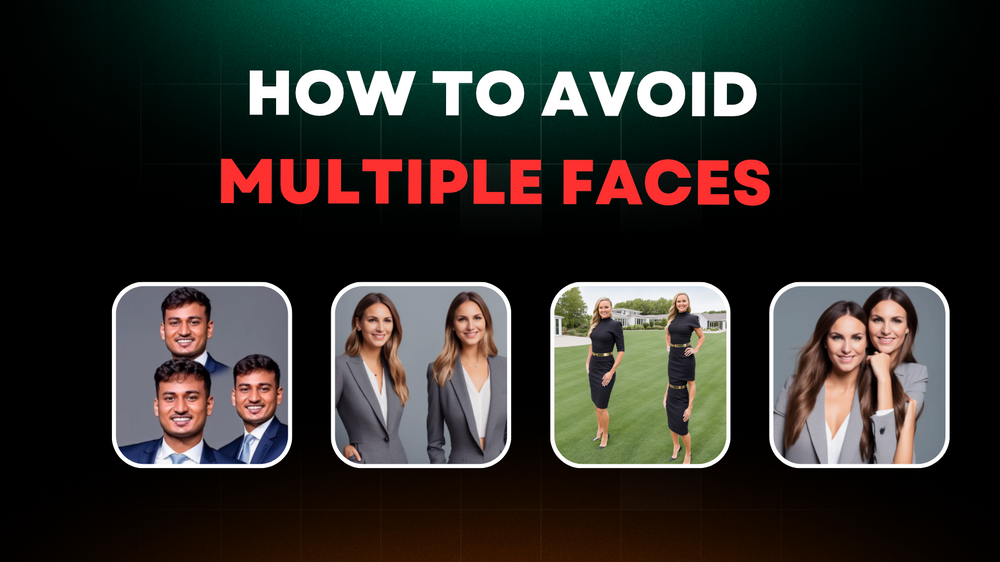
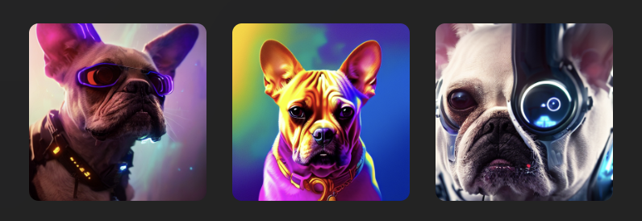

# 👨‍💼 [Framecast AI](https://headshots-starter.vercel.app/) - Professional Headshots with AI (powered by Astria.ai)

Introducing Framecast AI, an intuitive SaaS platform powered by [Astria](https://www.astria.ai/) that generates Professional AI Headshots in minutes.

This product is built to give developers & makers a great starting point into
building AI applications that can generate real revenue. This is your launch pad - modify it,
and make it your own to build a popular AI SaaS app.

## How It Works

Live demo **[here](https://framecast-ai.vercel.app/)**.

The app is powered by:

- 🚀 [Astria](https://www.astria.ai/) for AI model training & inference
- ▲ [Next.js](https://nextjs.org/) for app and landing page
- 🔋 [Supabase](https://supabase.com/) for DB & Auth
- 📩 [Resend](https://resend.com/) to email user when headshots are ready
- ⭐️ [Shadcn](https://ui.shadcn.com/) with [Tailwind CSS](https://tailwindcss.com/) for styles
- ▲ [Vercel](https://vercel.com/) for deployments
- 💳 [Stripe](https://stripe.com/) for billing

## Documentation: [Click here](https://framecast-ai.vercel.app/documentation)

## How To Get Good Results

The image samples used to teach the model what your face looks like are critical. Garbage in = garbage out.

- Enforce close-ups of faces and consider cropping so that the face is centered.
- Enforce images with only one person in the frame.
- Avoid accessories in samples like sunglasses and hats.
- Ensure the face is clearly visible. (For face detection, consider using tools like [Cloudinary API]

If you get distorted results with multiple faces, repeated subjects, multiple limbs, etc, make sure to follow these steps and minimize the chance of this happening:

- Make sure any samples uploaded are the same 1:1 height / width aspect ratio, for example 512x512, 1024x1024, etc.
- Avoid multiple people in the samples uploaded.
- Add "double torso, totem pole" to the negative prompt when generating.
- Make sure your dimensions when generating are also 1:1 with the same height / width ratios of the samples.

## Additional Use-Cases

Framecast AI can be easily adapted to support many other use-cases of [Astria](https://www.astria.ai/) including:

- AI Avatars
  - Anime
  - Portraits
  - Story Illustrations

- Pet Portraits

- Product Shots
- Food Photography

- Icons
- Style-Consistent Assets

& more!

## Resources and Support

- LinkedIn: [Jeryz](https://www.linkedin.com/company/jerrizz)
