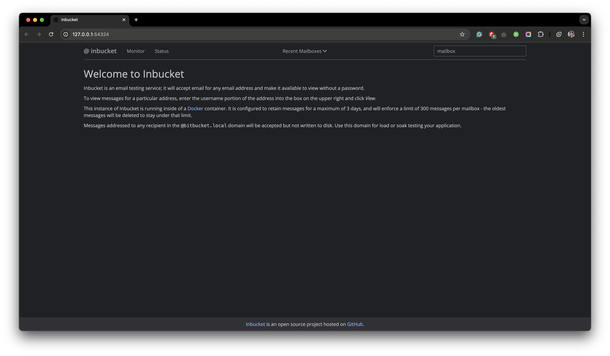

## Authentication

For authentication purposes, Framecast AI uses [Supabase Auth](https://supabase.com/docs/guides/auth) to implement
the backend for managing sign-ups and sign-ins using a link sent to your email. When running it locally, we are using
Docker to self host it on our local machine. Hence, the emails are recieved via your local server running on Docker.

To sign-in or sign-up, you will need to enter your email address and follow the given steps.

import { Steps } from 'nextra/components'
 
<Steps>

### Enter Email Address

Navigate to the [Framecast AI Signin Page](http://localhost:3000/overview) and enter your email address.

### Visit Inbucket

The current instance of Supabase running on one of your terminals will also provide an `Inbucket URL`. Navigate to
the `Monitor` tab in order to view the email sent to you.

</Steps>

Given below in an image of the Inbucket interface:

<figure>
  <></>
  <figcaption>
    Inbucket interface used to view the emails sent to the user.
  </figcaption>
</figure>
