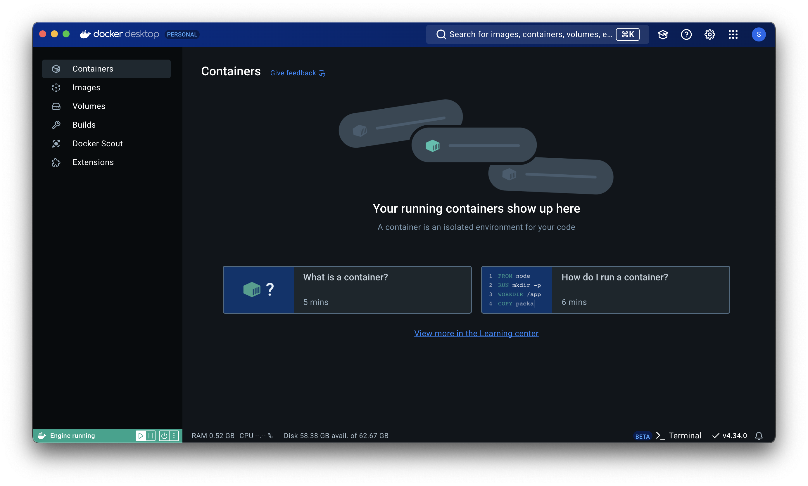

## Docker

To run Framecast AI locally, you can use [Docker](https://www.docker.com/). This is the easiest way to get started
 with Framecast AI. Visit the official Docker website to download and install Docker on your machine.

 Once downloaded, make sure to keep the docker window open and running in the background as shown in the image below:

 <figure>
  <></>
  <figcaption>A running window of a docker desktop application.</figcaption>
</figure>