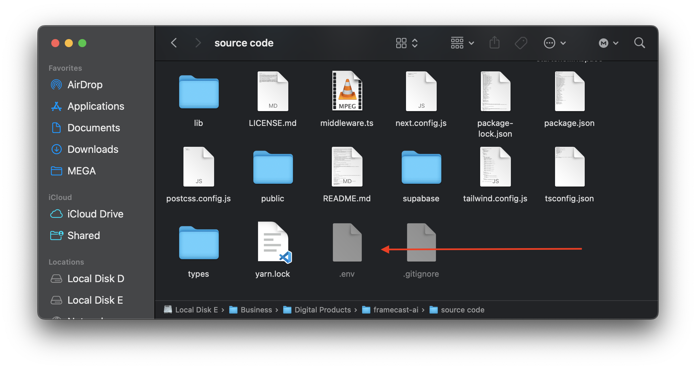

## Creating Environment Variables

You need to create an `.env` file in your project root directory and add the following environment variables:

```json filename=".env" copy
# ASTRIA (AI service)
# Get API key - https://www.astria.ai/users/edit#api
ASTRIA_API_KEY = your-astria-api-key

# Generate a random secret e.g. shadf892yr398hq23h
APP_WEBHOOK_SECRET = your-app-webhook-secret

# If enabled, Astria will be enabled in test mode which will not charge you,
# but will return dummy results.
ASTRIA_TEST_MODE = false


# SUPABASE (Database service)
# Locally get Supabase details from your your local server running supabase - http://127.0.0.1:54321
# For local environment, you can use the following values:
NEXT_PUBLIC_SUPABASE_URL = your-supabase-url
NEXT_PUBLIC_SUPABASE_ANON_KEY = your-supabase-anon-key
SUPABASE_SERVICE_ROLE_KEY = your-supabase-service-role-key
SUPABASE_ANON_KEY = your-supabase-anon-key
SUPABASE_URL = your-supabase-url


# VERCEL BLOB (Image storage service)
BLOB_READ_WRITE_TOKEN = your-vercel-blob-read-write-token


# RESEND (Email service)
RESEND_API_KEY = your-resend-api-key
RESEND_SENDER_EMAIL = your-resend-sender-email


# STRIPE (Payment service)
STRIPE_SECRET_KEY = your-stripe-secret-key
STRIPE_WEBHOOK_SECRET = your-stripe-webhook-secret
NEXT_PUBLIC_STRIPE_PRICE_ID_ONE_CREDIT = your-stripe-price-id-one-credit
NEXT_PUBLIC_STRIPE_PRICE_ID_THREE_CREDITS = your-stripe-price-id-three-credits
NEXT_PUBLIC_STRIPE_PRICE_ID_FIVE_CREDITS = your-stripe-price-id-five-credits
NEXT_PUBLIC_STRIPE_IS_ENABLED = true # set to true to enable Stripe payments


# PAYPAL (Payment service)
NEXT_PUBLIC_PAYPAL_CLIENT_ID = your-paypal-client-id


# RAZORPAY (Payment service)
NEXT_PUBLIC_RAZORPAY_KEY_ID = your-razorpay-key-id
RAZORPAY_KEY_SECRET = your-razorpay-key-secret


# DEPLOYMENT
DEPLOYMENT_PROVIDER = vercel # or replit
APP_URL = your-app-url # e.g. localhost:3000


# APP URL
NEXT_PUBLIC_APP_URL = your-app-url # e.g. http://localhost:3000

```

This is how your project root directory should look after creating the .env file:

<figure>
  <></>
  <figcaption>Post creation of .env file in project root directory.</figcaption>
</figure>
