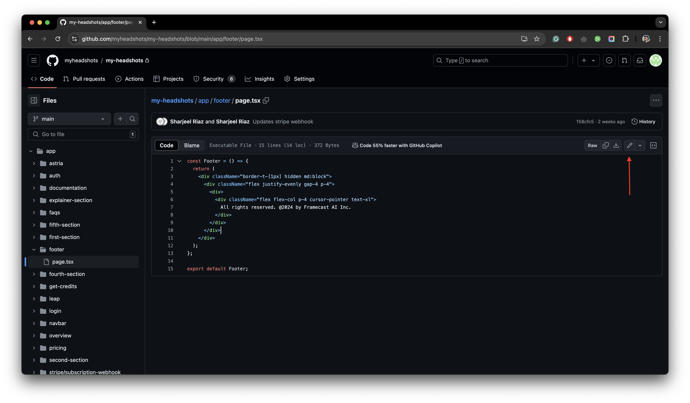
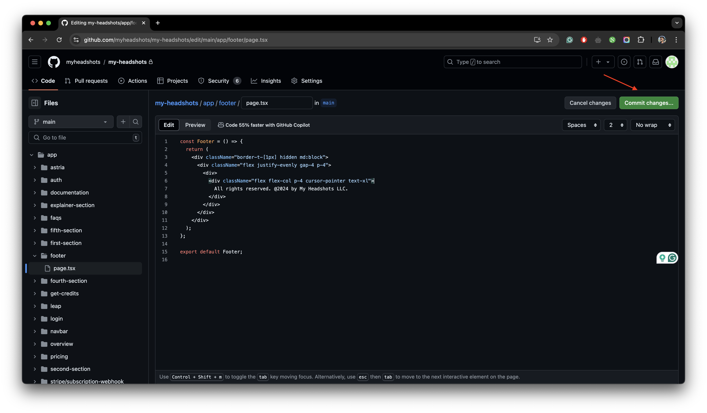
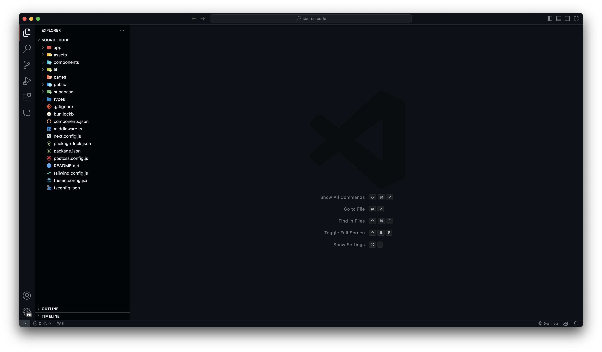

## Customizing Codebase

import { FileTree } from "nextra/components";
import { Callout } from "nextra/components";

There are two ways to customize the Framecast AI codebase:

- Using GitHub
- Using A Code Editor

### Using GitHub

You can use GitHub to customize the Framecast AI codebase. Here's how:

import { Steps } from 'nextra/components'
 
<Steps>

### Navigate To The Right Path

Open [GitHub](https://github.com) and make sure you have signed in, Click on your `Profile Icon` at top right corner
and select `Your repositories`. Click on the repository you want to customize.

### Understanding The Structure Of The Codebase

The following file tree explains how the structure of your codebase should look like in your remote repository:

<FileTree>
  <FileTree.Folder name="app">
    <FileTree.File name="other files" />
  </FileTree.Folder>
  <FileTree.Folder name="assets">
    <FileTree.File name="other files" />
  </FileTree.Folder>
  <FileTree.Folder name="components">
    <FileTree.File name="other files" />
  </FileTree.Folder>
  <FileTree.Folder name="lib">
    <FileTree.File name="other files" />
  </FileTree.Folder>
  <FileTree.Folder name="pages">
    <FileTree.File name="other files" />
  </FileTree.Folder>
  <FileTree.Folder name="public">
    <FileTree.File name="other files" />
  </FileTree.Folder>
  <FileTree.Folder name="supabase">
    <FileTree.File name="other files" />
  </FileTree.Folder>
  <FileTree.Folder name="types">
    <FileTree.File name="other files" />
  </FileTree.Folder>
  <FileTree.File name=".gitignore" />
  <FileTree.File name="README.md" />
  <FileTree.File name="bun.lockb" />
  <FileTree.File name="components.json" />
  <FileTree.File name="middleware.ts" />
  <FileTree.File name="next.config.js" />
  <FileTree.File name="package-lock.json" />
  <FileTree.File name="package.json" />
  <FileTree.File name="postcss.config.js" />
  <FileTree.File name="tailwind.config.js" />
  <FileTree.File name="theme.config.jsx" />
  <FileTree.File name="tsconfig.json" />
</FileTree>

<Callout type="error">
  Please make sure not to touch or modify the files or part of the files that
  are not mentioned in the guide. These files include most of the files
  containing the core functionality of the application. Don't replace any
  sensitive piece of code without much knowledge if you're someone who is not
  familiar with coding in the provided tech-stack.
</Callout>

- The `app` folder contains all the necessary sections of your application. You can customize the codebase by
  modifying the files in this folder. For example: If you want to change the headings of your navbar, you can do so by
  selecting the `navbar` folder and finding the appropriate files. Replace the text with your desired text and save the
  file.

- The `assets` folder contains all the images and other media files used in your application. You can customize the
  codebase by modifying the files in this folder. Please make sure that if you're replacing any logo's or images, the
  file name should be the same as the original file name.

- The `pages` folder contains the documentation and other pages of your application. You can customize this like any
  other file we have mentioned in the guide so far.

- The `public` folder contains all the public files of your application. Public files also include some images
  and graphics that you can customize by keeping the same file name and replacing the original file.

### Submitting Changes

After you have changed the necessary text or images, you can submit the changes by clicking `Commit Changes` button.
Given below are some images on how this step gets performed.

<figure>
  <></>
  <figcaption>Editing the footer section of the application.</figcaption>
</figure>

<figure>
  <></>
  <figcaption>Committing changes on the file.</figcaption>
</figure>

Your repository is connected to Vercel. Hence, in a few minutes the changes will be automatically deployed to your
production environment running on Vercel.

<Callout type="warning">
  Please note that everytime you make a change by clicking the `Commit Changes`
  button, an update to your production build will be triggered. This can cause
  downtime for your users. The more changes you make the more builds in queue
  will be created. It is recommended to make all the necessary changes at once
  and then commit them.
</Callout>

</Steps>

### Using A Code Editor

You can also use a code editor to customize the Framecast AI codebase. Using a code editor is useful specifically
if you're familiar with coding and want to make more advanced or a lot of changes at the same time. Some of the
recommended code editors are:

- [Visual Studio Code](https://code.visualstudio.com/)
- [Sublime Text](https://www.sublimetext.com/)
- [Cursor](https://www.cursor.com/)

For our example, we will use Visual Studio Code. Here's how you can customize the Framecast AI codebase using Visual
Studio Code:

<Steps>

### Setup Codebase In Code Editor

Open Visual Studio Code and click on `File` > `Open Folder`. Select the folder where you have the Framecast AI
codebase.

### Understanding The Structure Of The Codebase

The following file tree explains how the structure of your codebase should look like in your code editor:

<FileTree>
  <FileTree.Folder name="app">
    <FileTree.File name="other files" />
  </FileTree.Folder>
  <FileTree.Folder name="assets">
    <FileTree.File name="other files" />
  </FileTree.Folder>
  <FileTree.Folder name="components">
    <FileTree.File name="other files" />
  </FileTree.Folder>
  <FileTree.Folder name="lib">
    <FileTree.File name="other files" />
  </FileTree.Folder>
  <FileTree.Folder name="pages">
    <FileTree.File name="other files" />
  </FileTree.Folder>
  <FileTree.Folder name="public">
    <FileTree.File name="other files" />
  </FileTree.Folder>
  <FileTree.Folder name="supabase">
    <FileTree.File name="other files" />
  </FileTree.Folder>
  <FileTree.Folder name="types">
    <FileTree.File name="other files" />
  </FileTree.Folder>
  <FileTree.File name=".gitignore" />
  <FileTree.File name="README.md" />
  <FileTree.File name="bun.lockb" />
  <FileTree.File name="components.json" />
  <FileTree.File name="middleware.ts" />
  <FileTree.File name="next.config.js" />
  <FileTree.File name="package-lock.json" />
  <FileTree.File name="package.json" />
  <FileTree.File name="postcss.config.js" />
  <FileTree.File name="tailwind.config.js" />
  <FileTree.File name="theme.config.jsx" />
  <FileTree.File name="tsconfig.json" />
</FileTree>

<Callout type="error">
  Please make sure not to touch or modify the files or part of the files that
  are not mentioned in the guide. These files include most of the files
  containing the core functionality of the application. Don't replace any
  sensitive piece of code without much knowledge if you're someone who is not
  familiar with coding in the provided tech-stack.
</Callout>

- The `app` folder contains all the necessary sections of your application. You can customize the codebase by
  modifying the files in this folder. For example: If you want to change the headings of your navbar, you can do so by
  selecting the `navbar` folder and finding the appropriate files. Replace the text with your desired text and save the
  file.

- The `assets` folder contains all the images and other media files used in your application. You can customize the
  codebase by modifying the files in this folder. Please make sure that if you're replacing any logo's or images, the
  file name should be the same as the original file name.

- The `pages` folder contains the documentation and other pages of your application. You can customize this like any
  other file we have mentioned in the guide so far.

- The `public` folder contains all the public files of your application. Public files also include some images
  and graphics that you can customize by keeping the same file name and replacing the original file.

### Submitting Changes

After you have changed the necessary text or images, you can submit the changes by clicking `Control + S` button.
Given below are some images on how this step gets performed.

<figure>
  <></>
  <figcaption>Codebase setup in a code editor.</figcaption>
</figure>

<figure>
  <></>
  <figcaption>Editing the footer section of the application.</figcaption>
</figure>

Your source code folder should have been initialized as a git repository already since you followed our guide.
You can commit the changes by running the following commands:

```json filename=terminal copy
git add .
```

```json filename=terminal copy
git commit -m "Your commit message"
```

```json filename=terminal copy
git push
```

Your repository is connected to Vercel. Hence, in a few minutes the changes will be automatically deployed to your production environment running on Vercel.

<Callout type="info">
  This is the recommended way to make changes to your codebase. With this you
  can easily make a lot of changes at the same time.
</Callout>

</Steps>
