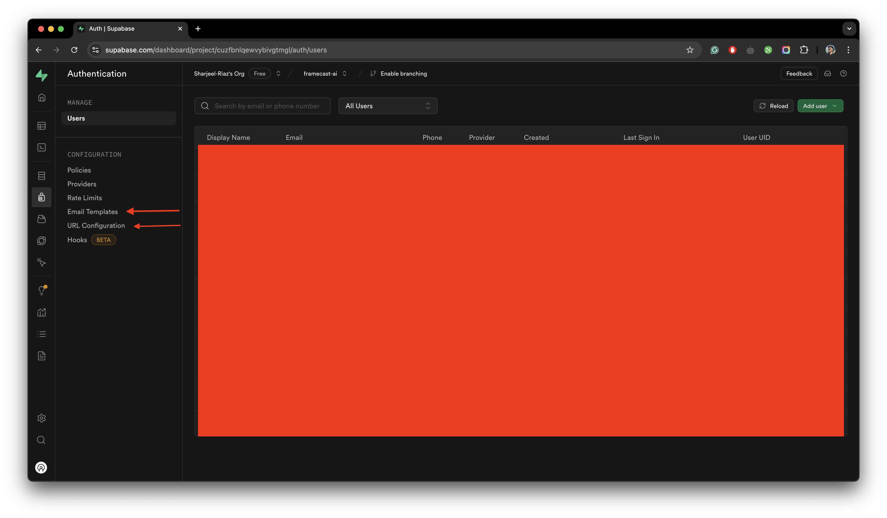

## Supabase

import { Callout } from "nextra/components";

<Callout type="info">
  Supabase is completely open-source. Personally, we're using Supabase itself to
  host the database. The experience has been smooth with no issues. You can also
  use its self-hosting capabilities to host it on your own server or using
  Docker as shown in the guide.
</Callout>

<Callout type="warning">
  We're using Supabase itself to host our database, so this guide will revolve
  around that. Although, if that's not the case and you're using some other
  option such as [AWS](https://aws.amazon.com/) or other cloud platforms to
  [Self-host Supabase](https://supabase.com/docs/guides/self-hosting), the steps
  are pretty much the same.
</Callout>

The database service used in Framecast AI is [Supabase](https://supabase.com/). Supabase is an open-source Firebase alternative. It is a
service that provides a Postgres database with a RESTful API, authentication, and real-time capabilities.

To use Supabase for production environment, you need to create an account on [Supabase](https://supabase.com/) and
follow the given steps:

import { Steps } from 'nextra/components'
 
<Steps>

### Create A New Project

Once you have created an account on Supabase and a new organization, create a new project by clicking on the
`New Project` button. Once the project is created, you will be redirected to the project dashboard.

### Replacing Supabase URL, Supabase Anon Key, and Supabase Service Role Key

Replace `your-supabase-url` with your original `Supabase URL`, `your-supabase-anon-key` with your original
`Supabase Anon Key`, and `your-supabase-service-role-key` with your original `Supabase Service Role Key`. To find
these keys, navigate to your project dashboard and click on the `Project Settings` tab. You will be able to see
`API Settings`. This is where you will find these keys.

### Ensure Replaced Values For Public Variables

Ensure that the replaced values are also repeated for the public variables `NEXT_PUBLIC_SUPABASE_URL` and
`NEXT_PUBLIC_SUPABASE_ANON_KEY`. For certain services, the public variables are used to access the values in the
database.

### Create Database Tables

In your `source code` folder, you will find a folder named `supabase`. This folder contains the SQL files for the
database tables. Navigate to this folder and open `migrations` folder inside. You will find the SQL file named
`RandomNumber_remote_schema`. Open it and copy all of the PostgreSQL queries. Now, navigate to your project dashboard
and click on the `SQL Editor` tab. Paste the copied queries in the `SQL Editor` and click on the `Run` button.
This will create the necessary tables in your database.

### Connect SMTP

Supabase by default has a limit on 3 emails/hr. Since it costs them money obviously, it's advisable to use our own
email service. For this example, we're using [Resend](https://resend.com). Feel free to use any other service you want.
The procedure for all of them is pretty much the same. Navigate to `Project Settings` and click on `Authentication`
from the left sidebar. Scroll down until you see `SMTP Settings`. Enable `SMTP Settings`. Once enabled, enter the
following details:

```json filename="SMTP Provider Settings" copy
Sender email = anyname@your-resend-verified-domain e.g. myheadshots@codewithme.com
Sender name = any name (This will be the name used for your email entry as the sender's name)
Host = smtp.resend.com
Port number = 465
Minimum interval between emails being sent = 60
Username = resend
Password = your-resend-api-key
```

<Callout type="info">
  Except the sender details (email and name), other settings would be different
  for different email providers such as AWS or Titan Email.
</Callout>

<figure>
  <></>
  <figcaption>
    An example of how to setup your SMTP provider settings in your supabase
    project.
  </figcaption>
</figure>

### Setup Authentication

The last step is to setup your authentication services. Navigate to the `Authentication` tab from your sidebar. Click
on `Email Templates`. From the navigation tabs on top, select `Magic Link`. Paste the following code snippet in the
`Source` textbox:

```json filename="Source" copy
<h2>Magic Link</h2>
<p>Follow this link to login:</p>
<p><a href="{{ .SiteURL }}auth/confirm?token_hash={{ .TokenHash }}&type=email">Log In</a></p>
```

Feel free to customize the email template as per your requirements. Once done, click on the `Save` button.

<Callout type="warning">
  The following step requires you to have the application deployed. Right now,
  you can enter a dummy URL and redirect URL. Once you have deployed your
  application, you can come back and update these URLs.
</Callout>

Afterwards, Navigate to the `URL Configuration` tab from the sidebar. In the `Site URL` field, enter your
application's URL and click on the `Save` button. Similarly, for the `Redirect URLs`. Click on `Add URL` button
and add a new URL like given below:

```json filename="Redirect URLs" copy
Site URL = your-application-url
(e.g. https://framecast-ai.vercel.app/ make sure there's a trailing slash)

Redirect URL = your-application-url/**
(e.g. https://framecast-ai.vercel.app/** make sure there's a trailing slash with two asterisks)
```

<figure>
  <></>
  <figcaption>
    An example of where to navigate on your supabase dashboard.
  </figcaption>
</figure>

This completes your database setup on Supabase. You can now proceed to deploy your application.

</Steps>
