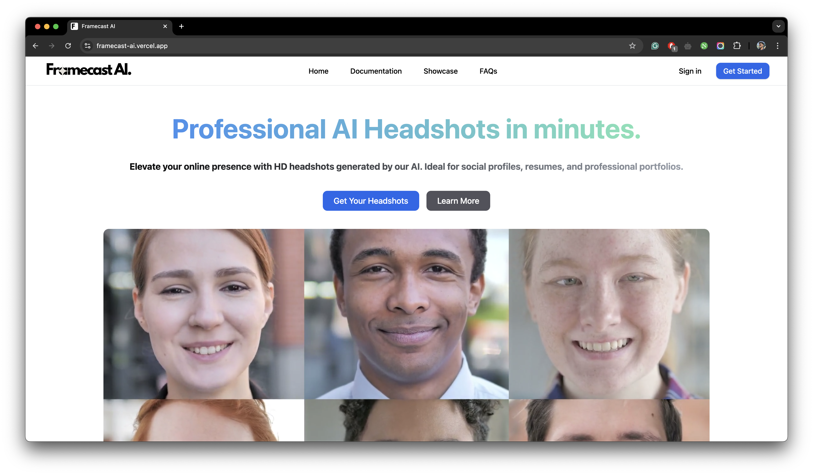

## Vercel Deployment

import { Callout } from "nextra/components";

<Callout type="warning">
  We're using Vercel and it's image storage SDK within the codebase. While it's
  possible to host it on any other platform, It's advisable to host it on Vercel
  for a seamless experience.
</Callout>

In this section, we will deploy Framecast AI to [Vercel](https://vercel.com/). Vercel provides the developer tools
and cloud infrastructure to build, scale, and secure a faster, more personalized web. It's hassle-free one click
deployment makes it a popular choice where you can deploy as many applications as you want for zero cost.

Before deploying Framecast AI to Vercel, Make sure that you have [Signed Up](https://vercel.com/signup) on Vercel.
For a much easier deployment process, you can do this using your GitHub account. Follow the given steps:

import { Steps } from 'nextra/components'
 
<Steps>

### Import Git Repository

On tha dashboard, click on the `Add New` button. A toolbar will appear. Click on the `Project` button.
Connect your GitHub account if you have'nt yet. You will be asked to select a Git repository. Select your project
repository from the list. Click on `Import` button. Select a project name and open the `Environment Variables` tab.
Make sure you have collected all of your environment variables before proceeding. Given below are the only
environment variables where you need to use dummy values. The rest of them should be available. If they're not, you
might have missed a part in the guide. Copy all of your obtained values and paste them in the
`Environment Variables` tab.

<Callout type="info">
  You can copy and paste all of them at once. Once you have copied the keys with
  their values, just paste them in the `Key` field. The values will be
  automatically filled in the `Value` field.
</Callout>

```json filename=".env" copy
# VERCEL BLOB VARS (Image storage service)
BLOB_READ_WRITE_TOKEN = "dummy value"

# DEPLOYMENT
DEPLOYMENT_PROVIDER = vercel # or replit
APP_URL = dummy.value

# APP URL
NEXT_PUBLIC_APP_URL = dummy.value
```

Copy these dummy values as they are and paste them in the `Environment Variables` tab as well. Click on the
`Deploy` button.

<figure>
  <></>
  <figcaption>The deployment page on Vercel.</figcaption>
</figure>

### Replacing Dummy URLs

Go back to your Supabase project dashboard and replace the dummy `Site URL` & `Redirect URL` with the actual URLs.

### Connect Blob Storage

After the deployment is complete, navigate to the `Storage` tab and click `Create Database` button. Select `Blob`
and click on the `Continue` button. You will be asked to enter a name for the blob. Enter a name and create the blob.
Now, make sure it's connected to your present project where Framecast AI has been deployed. If it isn't then on the
same page as show below, click on `Connect Database` button and select the blob store you just created. Once connected,
you will see the updated value of the blob environment variable under the `Environment Variables` tab. You can find this
in the settings section.

<figure>
  <></>
  <figcaption>
    An example of storage section to create Blob storage on Vercel.
  </figcaption>
</figure>

### Update Environment Variables

<Callout type="warning">
  Please remember to visit the supabase dashboard and update the `Site URL` and
  `Redirect URL` with the actual URLs.
</Callout>

As you have connected the blob storage and deployed the application, you need to update the following environment
variables if you haven't already:

```json filename=".env" copy
# DEPLOYMENT
APP_URL = your-app-url-without-https (e.g. myheadshots-ai.vercel.app)

# APP URL
NEXT_PUBLIC_APP_URL = your-full-app-url (e.g. https://myheadshots-ai.vercel.app)
```

Make sure to save the changes after updating the environment variables.

### Redeploy The Application

After connecting the blob storage, and ensuring every environment variable is setup properly. You need to redeploy
the application. Go to the `Deployments` tab and click on the `Three Dots` button of the latest deployment.
Click on the `Redeploy` button. This will redeploy the application with the updated environment variables.

</Steps>

<figure>
  <></>
  <figcaption>Framecast AI running in a live environment.</figcaption>
</figure>

Framecast AI is ready and fully functional to use now.
