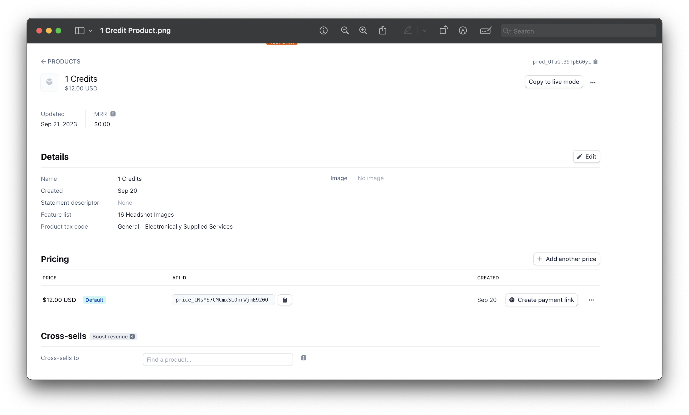
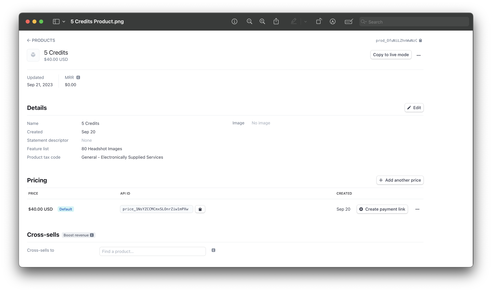

## Integrating Payment Gateways

Currently Framecast AI supports the following payment gateways:

- [Stripe](https://stripe.com/)
- [PayPal](https://www.paypal.com/)
- [Razorpay](https://razorpay.com/)

We will guide you through the process of integrating these payment gateways into your Framecast AI application.

### Stripe

The current setup for a credit based system is `1 credit = 1 model` for training headshots. To enable Stripe billing, you
will need to fill out the following fields in your .env file:

import { Steps } from 'nextra/components'
 
<Steps>

### Replacing Secret Key

Replace `your-stripe-secret-key` with your original `Stripe Secret key` from [Stripe dashboard page](https://dashboard.stripe.com/).

### Replacing Webhook Secret

Replace `your-stripe-webhook-secret` with your original `Stripe Webhook Secret` from [Stripe webhook page](https://dashboard.stripe.com/webhooks)
by creating a new endpoint that points to the following URL: `your-app-url/stripe/subscription-webhook`. The webhook
should be listening for the `checkout.session.completed`.

### Enabling Stripe

Set `NEXT_PUBLIC_STRIPE_IS_ENABLED` to `true` if it is'nt to enable Stripe payments.

</Steps>

import { Callout } from "nextra/components";

<Callout type="warning">
  Currently you can only offer three credit packages: 1, 3, and 5. If you want
  to offer more or different packages, you will need to customize the code
  accordingly.
</Callout>

Now you need to create a Stripe Price for each credit package you want to offer. For example, if you want to offer
1, 3, and 5 credits, you will need to create 3 prices in Stripe.

<Steps>

### Replacing First Price ID

Replace `your-stripe-price-id-one-credit` with your original `Stripe Price ID` by creating a new price product
from [Stripe product page](https://dashboard.stripe.com/products).

### Replacing Second Price ID

Replace `your-stripe-price-id-three-credits` with your original `Stripe Price ID` by creating a new price product
from [Stripe product page](https://dashboard.stripe.com/products).

### Replacing Third Price ID

Replace `your-stripe-price-id-five-credits` with your original `Stripe Price ID` by creating a new price product
from [Stripe product page](https://dashboard.stripe.com/products).

</Steps>

Following are the products you need to create on your [Stripe product page](https://dashboard.stripe.com/products):

<figure>
  <></>
  <figcaption>Example for a product with 1 credit.</figcaption>
</figure>

<figure>
  <></>
  <figcaption>Example for a product with 3 credits.</figcaption>
</figure>

<figure>
  <></>
  <figcaption>Example for a product with 5 credits.</figcaption>
</figure>

### PayPal

To enable PayPal billing, you will need to perform the following steps:

<Steps>

### Login to PayPal

Login to your [PayPal account](https://developer.paypal.com/dashboard/) and create a new application to
get the `Client ID`.

### Creating A New Application

Select `Apps & Credentials`. New accounts come with a Default Application in the REST API apps section. To
create a new project, select `Create App`.

### Replacing PayPal Client ID

You only need the `PayPal Client ID`. No need for your client secret. Replace `your-paypal-client-id` with your
original `PayPal Client ID`.

</Steps>

### Razorpay

To enable Razorpay billing, you will need to perform the following steps:

<Steps>

### Login to Razorpay

Login to your [Razorpay account](https://dashboard.razorpay.com/signin?screen=sign_in) with the appropriate
credentials. Make sure `Live mode` is turned on.

### Navigate To Right Section

Navigate to `Account & Settings` → `API Keys` (under Website and app settings) → `Generate Key` to generate key for
the selected `Live mode`.

### Replacing Razorpay Key ID and Razorpay Key Secret

The `Key ID` and `Key Secret` should appear on a pop-up page. Replace `your-razorpay-key-id` with your original
`Razorpay Key ID` and `your-razorpay-key-secret` with your original `Razorpay Key Secret`.

</Steps>
